# ml-rl-taxi

## Problem addressed

In this project, a reinforcement learning agent is trained to solve the Taxi-v3 environment provided by the Gymnasium framework.

The project implemented:

- the Taxi-v3 environment as the learning task

- train agent using Tabular Q-learning

- train agent single NN Deep Q-Network

- Finally, compare the behavior and performance of the two approaches within the same environment.

### Taxi-v3 description

Taxi-v3 is a discrete 5x5 grid-world environment in which an agent controls a taxi to pick up and drop off passengers at four locations.

- The taxi starts off at a random square
- and the passenger at one of the 4 designated (Red, Green, Yellow and Blue) locations.
- 4 locationsto pick up and drop off
- 6 actions an agent can do
  - 0: Move south (down)
  - 1: Move north (up)
  - 2: Move east (right)
  - 3: Move west (left)
  - 4: Pickup passenger
  - 5: Drop off passenger
- The goal is
  - navigating to a passenger pickup location,
  - picking up the passenger,
  - navigating to the destination,
  - and dropping off the passenger at the correct location
  - Illegal pickup or drop-off actions are penalized

### Reinforcement description

The environment is modeled as a deterministic MDP $ M = (S, A, \delta, r)$, with $\delta$ is unknown to agent and reward values $r$ are observable during interaction.

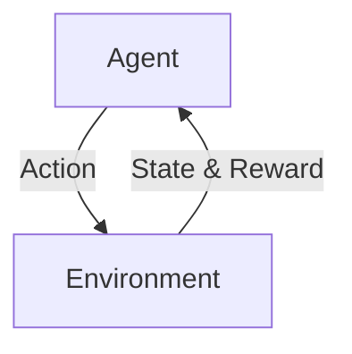

- observation space:Discrete(500)
- action space:Discrete(6)
- episode ends when
  - terminitaion: The taxi drops off the passenger.
  - truncation: The length of the episode is `200`.
- env api
  - `reset()-> s,info`: initializes a new episode and returns the initial state of the environment.
  - `step(a) -> s', reward, terminated, truncated, info`: updates the environment state according to the selected action.

## The solution adopted

### Tabular Q-Learning

Q-function `Q(s,a)` represents the expected return of executing action a in state s and then acting optimally thereafter.Tabular in this context simply means that we will store the Q-function in a lookup table. I.e. create a table where we store the Q-value for each possible State and Action.

#### Update formula

The optimal action-value function satisfies the Bellman optimality equation:

$$
Q(s, a) = r(s, a) + \gamma \max_{a' \in A} Q(\delta(s, a), a')
$$

Using Temporal Difference (TD) learning with learning rate `α` and discount factor `γ`.
The Q-table is updated as:

$$
\hat{Q}(s, a) \leftarrow (1-\alpha)\hat{Q}(s, a) + \alpha [r + \gamma \max_{a'} \hat{Q}(s', a')]
$$

Equivalently:

$$
\hat{Q}(s,a) \leftarrow \hat{Q}(s,a)+ \underbrace{\alpha}_{\text{learning rate}} \Big[\underbrace{r + \overbrace{\gamma}^{\text{discount factor}}\max_{a'} \hat{Q}(s',a')}_{\text{TD target}}- \hat{Q}(s,a)\Big]
$$

For terminal states, no future reward is considered:

$$
TD target = r
$$

#### Action Selection: ε-Greedy Policy

- ε ∈ [0, 1]
- Exploitation: with probability 1−ε, select action a that maximizes $ \hat{Q}(s, a)$
- Exploration: with probability ε, select random action a (possibly lower ˆ Q(s, a))
- ε can decrease over time (prefer exploration first, then exploitation)
  - The exploration rate is decayed after each episode, but no less than lower bound. Agent maintains persistent exploration, reduces the risk of premature convergence caused by early estimation errors.
    $$
    \varepsilon \leftarrow \max\bigl(\varepsilon_{\min},\ \varepsilon \cdot \varepsilon_{\text{decay}}\bigr)
    $$
  - When exploiting, actions with the maximum Q-value are selected uniformly at random to avoid tie-breaking bias.
    $$
    a \sim \mathrm{Uniform}\!\left(\left\{ a \in A \mid Q(s,a) = \max_{a'} Q(s,a') \right\}\right)
    $$

#### Training Loop

For each episode

- Reset environment and observe initial state s

- Repeat until terminal or maximum steps reached:
  - Select action
  - Execute action and observe
  - Update Q-table using TD rule
  - update s to s'
- Episode ends, decay ε
- Log episode return, length, and ε

After training

- the learned Q-table is saved for later evaluation,
- and a training log is saved to generate learning curves.

### DQN

In Deep Q-Learning, the Q-function \( Q(s, a) \) still represents the expected return of executing action \( a \) in state \( s \) and then acting optimally thereafter. Instead of storing Q-values in a lookup table, DQN uses a neural network to approximate the Q-function.

- **Q-function approximation**

  In the DQN approach, the action-value function \( Q(s, a) \) is approximated by a neural network parameterized by \( \theta \). So we need to learn $\theta$ satisfies:

  $$
  Q_{\theta}(s, a) \approx Q(s, a)
  $$

- **Target computation**

  For each transition (s,a,r,s') the target value is computed using the Bellman optimality principle.

  $$
  y = r + \gamma \max_{a'} \hat{Q}_{\theta}(s', a')
  $$

- **Loss function: MSE**

  $$
  L(\theta) = (Q_{\theta}(s, a) - y)^2
  $$

- **Compute Gradient using BackPropgation** and get $\nabla_{\theta} L(\theta)$

- **Update $\theta$:** $\theta \leftarrow \theta - \alpha \, \nabla_{\theta} L(\theta)$

- **Action Selection: ε-Greedy Policy**: same as tabular Q_Learning

- **Replay Buffer**
  - To avoid temporal correlation between consecutive steps, we do not learning step by step.
  - Instead, we use a ReplayBuffer to store transitions(s,a,r,s',done) collected during interaction. Improves stability compared to online updates.
  - During learning, a mini-batch is uniformly sampled from ReplayBuffer
  - Training starts and updates only after a warm-up threshold: if len(buffer) > min_buffer

- **Training Loop**
  - For each episode
    - Reset environment and observe initial state \(s\)

    - Repeat until terminal or maximum steps reached:
      - Select action
      - Execute action and observe
      - store transition \((s,a,r,s',done)\) in replay buffer
      - If replay buffer has enough samples,start to learn and update $\theta$
      - Update \(s \leftarrow s'\)

    - Episode ends, decay ε
    - Log episode return, length, and ε

  - After training
    - Save the learned $\theta$ for evaluation
    - Save training logs for learning curves

- **Neural network architecture**

  We use a single fully connected neural network, with 2 hidden layers. The architecture is as follows
  <p align="center">
  
  </p>

  $$
  h_1 = \mathrm{ReLU}(b_1 + W_1 x)
  $$

  $$
  h_2 = \mathrm{ReLU}(b_2 + W_2 h_1)
  $$

  $$
  y = b_3 + W_3 h_2 \quad (\text{linear})
  $$

- The input layer takes the encoded environment state as input.
- The output layer has 6 neuron,represent 6 action, returning the estimated Q-values for all actions in the current state.

## The experimental results

### Tabular Q-Learning

#### Learning curve

The following figure shows the learning curve of Tabular Q-learning, with parameters `episodes = 10000` `α=0.1` `γ=0.99`. This setting is used as the baseline for comparison with different training configurations later.

<p align="center">
  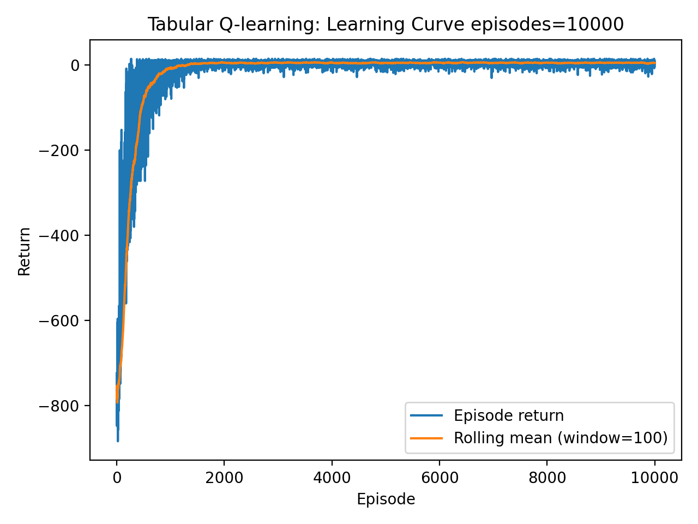
</p>

- The episode return increases rapidly during the early training phase.
- After a few thousand episodes, the rolling average becomes stable, indicating convergence of the learned policy.
- The remaining variability is limited and does not affect overall performance.

The final Q-table is evaluated over 100 episodes to measure performance. The results is as follow:

```text
=== Evaluation Summary ===
Episodes:      100
Avg return:    8.270
Avg length:    12.730
Success rate:  100.00%
Q-table path:  results/tabular_q.npy
Seed:          42
```

It indicate that the learned policy consistently completes the task successfully and does so efficiently, confirming that the policy obtained after training is both stable and effective.

#### Effect of Training Episodes

The following figures compare the learning curves obtained with different numbers of training episodes. The baseline setting uses `episodes = 10000`, while the number of episodes is reduced to `episodes = 2000` for comparison. All other parameters remain unchanged.

<div style="display:flex;justify-content:center; align-items:center; gap:20px;">
   
  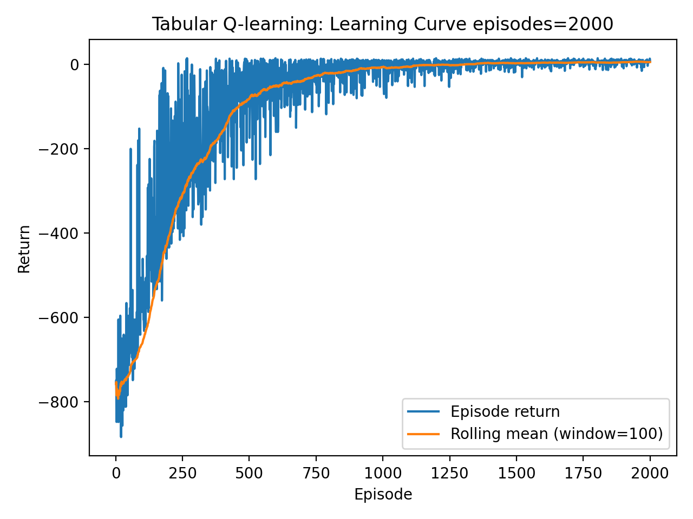
</div>

- With 10,000 episodes, the learning curve converges smoothly and remains stable.
- While With only 2,000 episodes, the episode exhibits larger fluctuations and does not fully stabilize compared to the baseline figure 1.

The Q-table trained with episodes = 2000 is also evaluated over 100 episodes. The evaluation results are shown below:

<table>
  <tr>
    <th>Ep = 10000</th>
    <th>Ep = 2000</th>
  </tr>
  <tr>
    <td>
      <pre><code>=== Evaluation Summary Ep=10000 ===
Episodes:      100
Avg return:    8.270
Avg length:    12.730
Success rate:  100.00%
Q-table path:  results/tabular_q.npy
Seed:          42</code></pre>
    </td>
    <td>
      <pre><code>=== Evaluation Summary Ep=2000 ===
Episodes:      100
Avg return:    -10.240
Avg length:    29.350
Success rate:  91.00%
Q-table path:  results/tabular_q.npy
Seed:          42</code></pre>
    </td>
  </tr>
</table>

The evaluation shows a lower average return, longer episode length, and a reduced success rate compared to the baseline. This indicates that training with fewer episodes leads to a less reliable and less efficient Q-table, confirming that insufficient training prevents full convergence.

#### Effect of Learning Rate (α)

The following figures compare the learning curves obtained with different learning rates.
The baseline setting uses `α = 0.1`, while the learning rate is increased to `α = 0.5` for comparison. All other parameters, including `episodes = 10000` and `γ = 0.99`, remain unchanged.

<div style="display:flex;justify-content:center; align-items:center; gap:20px;">
  
  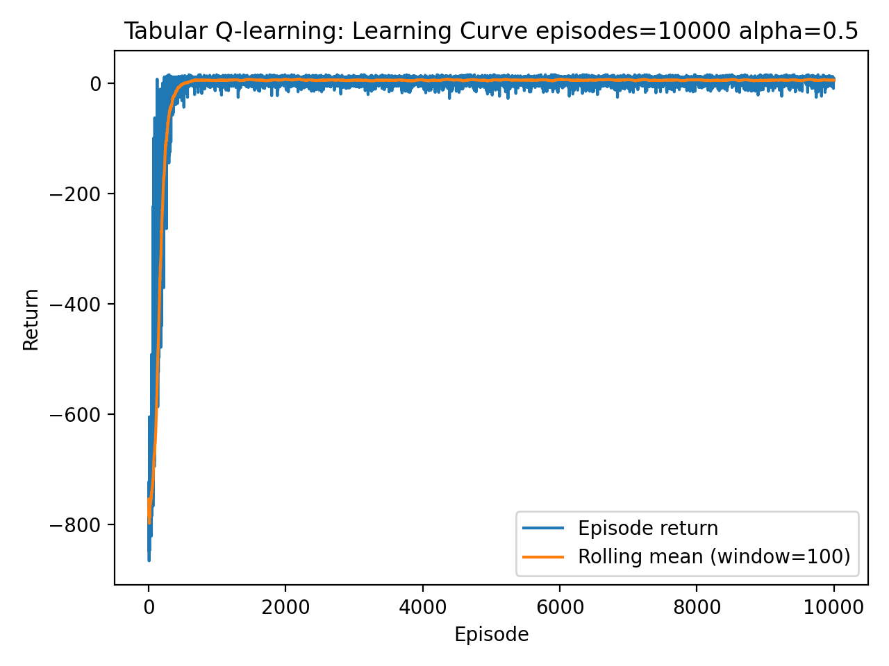
</div>

- Compared to the baseline (`α = 0.1`), a larger learning rate (`α = 0.5`) reaches a stable return value in fewer episodes and maintains a relatively stable performance thereafter.
- With larger α, agent learns faster.

The Q-table trained with `α = 0.5` is also evaluated over 100 episodes. The evaluation results are shown below:

<table>
  <tr>
    <th>α = 0.1</th>
    <th>α = 0.5</th>
  </tr>
  <tr>
    <td>
      <pre><code>=== Evaluation Summary α = 0.1 ===
Episodes:      100
Avg return:    8.270
Avg length:    12.730
Success rate:  100.00%
Q-table path:  results/tabular_q.npy
Seed:          42</code></pre>
    </td>
    <td>
      <pre><code>=== Evaluation Summaryα = 0.5 ===
Episodes:      100
Avg return:    8.150
Avg length:    12.850
Success rate:  100.00%
Q-table path:  results/tabular_q.npy
Seed:          42
</code></pre>
    </td>
  </tr>
</table>

Compared to the baseline setting, the evaluation shows slightly lower average return and a reduced success rate. This indicates that a larger learning rate accelerates learning but leads to less stable convergence, resulting in a less reliable Q-table.

#### Effect of Discount Factor (γ)

The following figures compare the learning curves obtained with different discount factors.
The baseline setting uses `γ = 0.99`, while the discount factor is reduced to `γ = 0.5` for comparison. All other parameters, including `episodes = 10000` and `α = 0.1`, remain unchanged.

<div style="display:flex;justify-content:center; align-items:center; gap:20px;">
  
  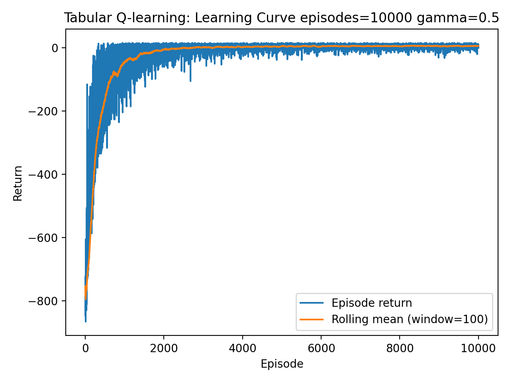
</div>

- With the baseline discount factor (γ = 0.99), the learning curve converges smoothly and remains stable faster.

- With a smaller discount factor (γ = 0.5), the episode return value improves more slowly and stabilizes after more runs.

The Q-table trained with `γ = 0.5` is also evaluated over 100 episodes. The evaluation results are shown below:

<table>
  <tr>
    <th>γ = 0.1</th>
    <th>γ = 0.5</th>
  </tr>
  <tr>
    <td>
      <pre><code>=== Evaluation Summary γ = 0.99 ===
Episodes:      100
Avg return:    8.270
Avg length:    12.730
Success rate:  100.00%
Q-table path:  results/tabular_q.npy
Seed:          42</code></pre>
    </td>
    <td>
      <pre><code>=== Evaluation Summary γ = 0.5 ===
Episodes:      100
Avg return:    -14.550
Avg length:    33.240
Success rate:  89.00%
Q-table path:  results/tabular_q.npy
Seed:          42
</code></pre>
</td>
</tr>
</table>

Compared to the baseline, the evaluation shows a lower average return, longer episode length, and a reduced success rate. This indicates that a smaller discount factor leads to weaker long-term performance, resulting in a less effective and less reliable Q-table.

### DQN

#### Learning curve

The following figure shows the learning curve of Tabular Q-learning, with parameters `episodes = 5000` `α=0.001` `γ=0.99`. This setting is used as the baseline for comparison with different training configurations later.

<p align="center">
  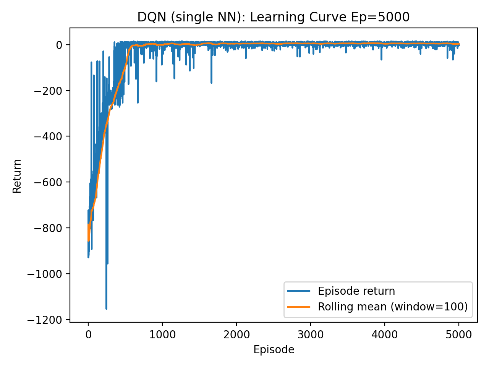
</p>

- The episode return increases rapidly during the early training phase, shows large fluctuations and very low values.

- The rolling average stabilizes after several thousand episodes, indicating convergence of the learned Q-function and that learned parameter θ is better approximate the function Q(s,a)

```text
=== DQN Evaluation Summary ===
Episodes:      100
Avg return:    8.270
Avg length:    12.730
Success rate:  100.00%
Model path:    results/dqn_single_nn.pt
Seed:          42

```

The results show that the learned policy is able to consistently complete the task, achieving stable episode returns and episode lengths. We know that the DQN agent successfully learns an effective policy for the Taxi-v3 environment.

#### Effect of Training Episodes

The following figures compare the learning curves of DQN trained with different numbers of episodes.The baseline setting uses `episodes = 5000`, while the number of training episodes is reduced to `episodes = 2000`. All other settings remain unchanged.

<div style="display:flex;justify-content:center; align-items:center; gap:20px;">
  
  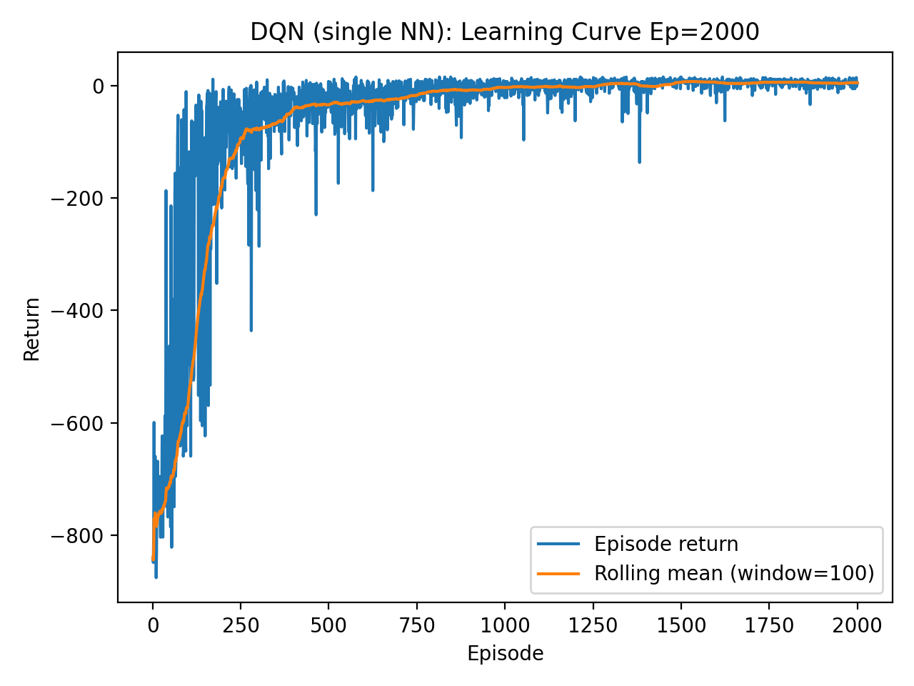
</div>

- Reducing the number of training episodes does not significantly change the final average return of the DQN.

- However, fewer episodes lead to higher variance in episode returns, indicating increased instability in the learned value function.

- With a shorter training horizon, the policy spends less time in the steady-state regime, - suggesting incomplete convergence.

- Increasing the number of training episodes improves the stability and robustness of the learned policy.

<table>
  <tr>
    <th>ep = 5000</th>
    <th>ep = 2000</th>
  </tr>
  <tr>
    <td>
      <pre><code>=== Evaluation Summary ep = 5000 ===
Episodes:      100
Avg return:    8.270
Avg length:    12.730
Success rate:  100.00%
Model path:    results/dqn_single_nn.pt
Seed:          42</code></pre>
    </td>
    <td>
      <pre><code>=== Evaluation Summary ep = 2000 ===
Episodes:      100
Avg return:    8.270
Avg length:    12.730
Success rate:  100.00%
Model path:    results/dqn_single_nn.pt
Seed:          42
</code></pre>
</td>
</tr>
</table>

- A 100% success rate is obtained in both cases, showing that the learned policies consistently solve the task.
- Fewer training episodes are sufficient to obtain an effective policy, while additional training mainly improves the robustness and reliability of convergence.

#### Effect of Learning Rate(α)

The following figures compare the learning curves of DQN trained with different learning rates.
The baseline setting uses the learning rate`α = 0.001`, while the learning rate is increased to `α = 0.1`.

<div style="display:flex;justify-content:center; align-items:center; gap:20px;">
  
  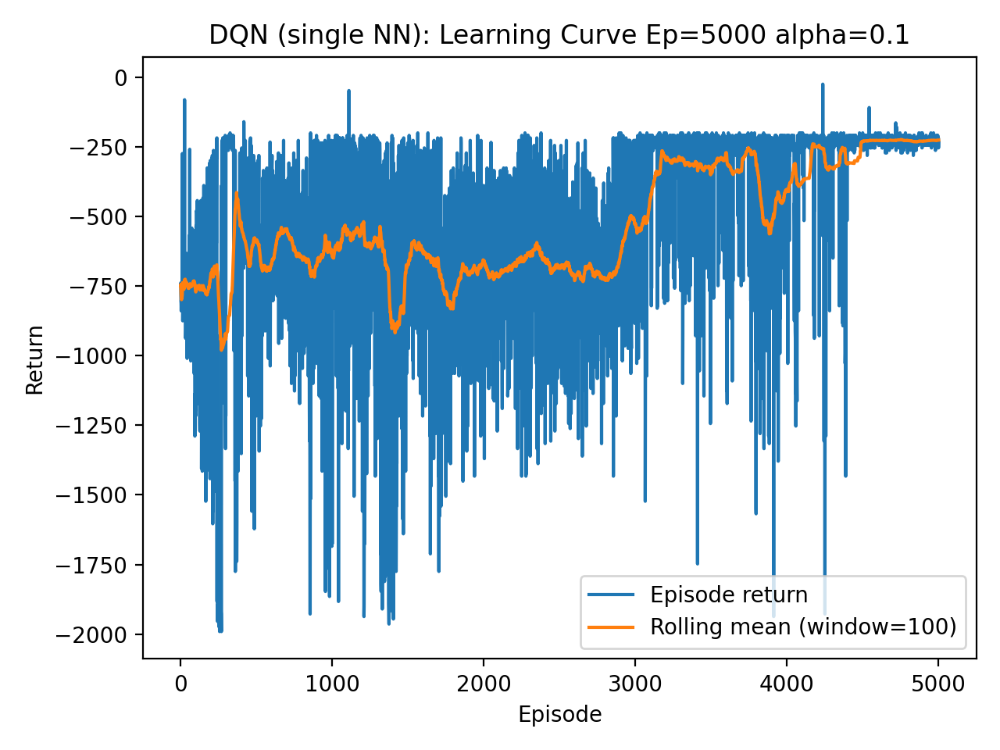
</div>

- When the learning rate is increased to α = 0.1, the episode returns exhibit significantly larger fluctuations throughout the entire training process.

- Even in the later stages of training, large negative performance spikes persist, indicating that the parameter updates do not allow the Q-function estimates to fully stabilize.

- Increasing the learning rate reduces training stability and the reliability of convergence, while a smaller learning rate facilitates more stable value estimation and more consistent convergence behavior.

<table>
  <tr>
    <th> alpha = 0.001</th>
    <th> alpha = 0.1</th>
  </tr>
  <tr>
    <td>
      <pre><code>=== Evaluation Summary alpha = 0.001 ===
Episodes:      100
Avg return:    8.270
Avg length:    12.730
Success rate:  100.00%
Model path:    results/dqn_single_nn.pt
Seed:          42</code></pre>
    </td>
    <td>
      <pre><code>=== DQN Evaluation Summary alpha = 0.1 ===
Episodes:      100
Avg return:    -200.000
Avg length:    200.000
Success rate:  0.00%
Model path:    results/dqn_single_nn.pt
Seed:          42
</code></pre>
</td>
</tr>
</table>

- When the learning rate is increased to `α = 0.1`, the agent fails to complete the task.

- The large discrepancy in evaluation performance indicates that high learning rate prevents the learned policy from generalizing effectively.

#### Effect of Discount Factor(γ)

The following figures compare the learning curves of DQN trained with different discount factors.
The baseline setting uses `γ = 0.99`, while the discount factor is reduced to `γ = 0.5`.
All other training settings remain unchanged.

<div style="display:flex;justify-content:center; align-items:center; gap:20px;">
  
  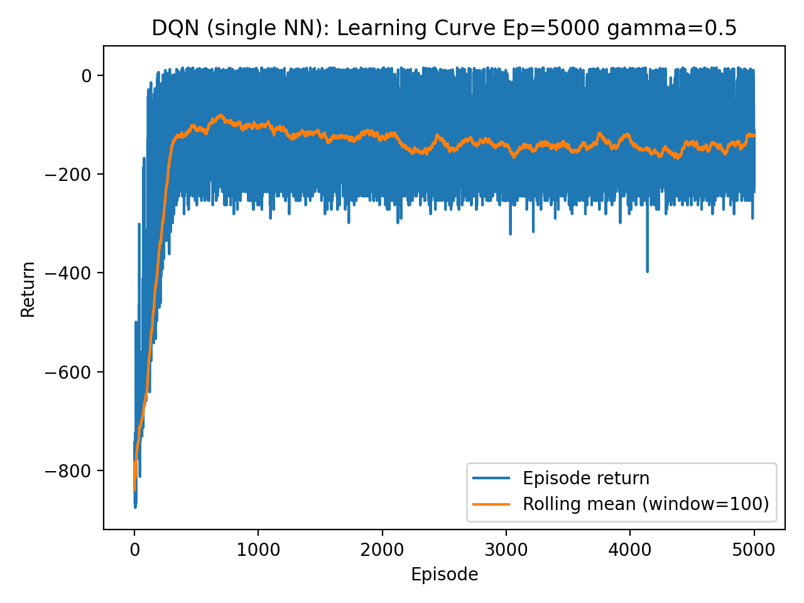
</div>

- When the discount factor is reduced to γ = 0.5, the rolling mean converges to a significantly lower return level, and episode returns continue to fluctuate in the later stages of training, resulting in overall performance that does not reach the level achieved with γ = 0.99.

- A smaller discount factor limits the agent’s ability to account for long-term rewards, leading to a suboptimal learned policy.
  <table>

    <tr>
      <th> gamma = 0.99</th>
      <th> gamma = 0.5</th>
    </tr>
    <tr>
      <td>
        <pre><code>=== Evaluation Summary gamma = 0.99 ===
  Episodes:      100
  Avg return:    8.270
  Avg length:    12.730
  Success rate:  100.00%
  Model path:    results/dqn_single_nn.pt
  Seed:          42</code></pre>
      </td>
      <td>
        <pre><code>=== DQN Evaluation Summary gamma = 0.5 ===
  Episodes:      100
  Avg return:    -183.040
  Avg length:    184.720
  Success rate:  8.00%
  Model path:    results/dqn_single_nn.pt
  Seed:          42
  </code></pre>
  </td>
  </tr>
  </table>

- When the discount factor is reduced to γ = 0.5, the agent’s performance degrades significantly, with the success rate dropping sharply from 100% to 8%, indicating that the learned policy cannot reliably complete the task under a smaller discount factor.

- Small discount factor severely degrades the quality of the learned policy.

### Comparation Tabular-Q Learning and DQN

The comparation between 2 methods:

<div style="display:flex;justify-content:center; align-items:center; gap:20px;">
  
  
</div>
- DQN is more sensitive to hyperparameters
<table>
  <tr>
    <th> DQN</th>
    <th> Tabular</th>
  </tr>
  <tr>
    <td>
      <pre><code>=== DQN Evaluation Summary ep=5000 ===
Episodes:      100
Avg return:    8.270
Avg length:    12.730
Success rate:  100.00%
Model path:    results/dqn_single_nn.pt
Seed:          42</code></pre>
    </td>
    <td>
      <pre><code>=== Tabular Evaluation Summary ep=5000 ===
Episodes:      100
Avg return:    8.270
Avg length:    12.730
Success rate:  100.00%
Q-table path:  results/tabular_q.npy
Seed:          42
</code></pre>
</td>
</tr>
</table>

- Both methods converge to similar return levels in the final stage of training, indicating that they are able to learn effective policies.

- DQN is highly sensitive to hyperparameter choices, which can significantly affect training stability and performance.

## The architecture of the implementation.

### Tabular

The implementation is organized around three main components:

- The tabular Q-learning agent: Implements the learning logic, including action selection, Q-value updates, and ε decay, and maintains the Q-table.
- Traning Loop: Coordinates the interaction between the agent and the Taxi environment over multiple episodes and drives the learning process.
- Evaluation and logging utilities: Record episode-level training statistics for learning-curve analysis and evaluate the learned Q-table after training.

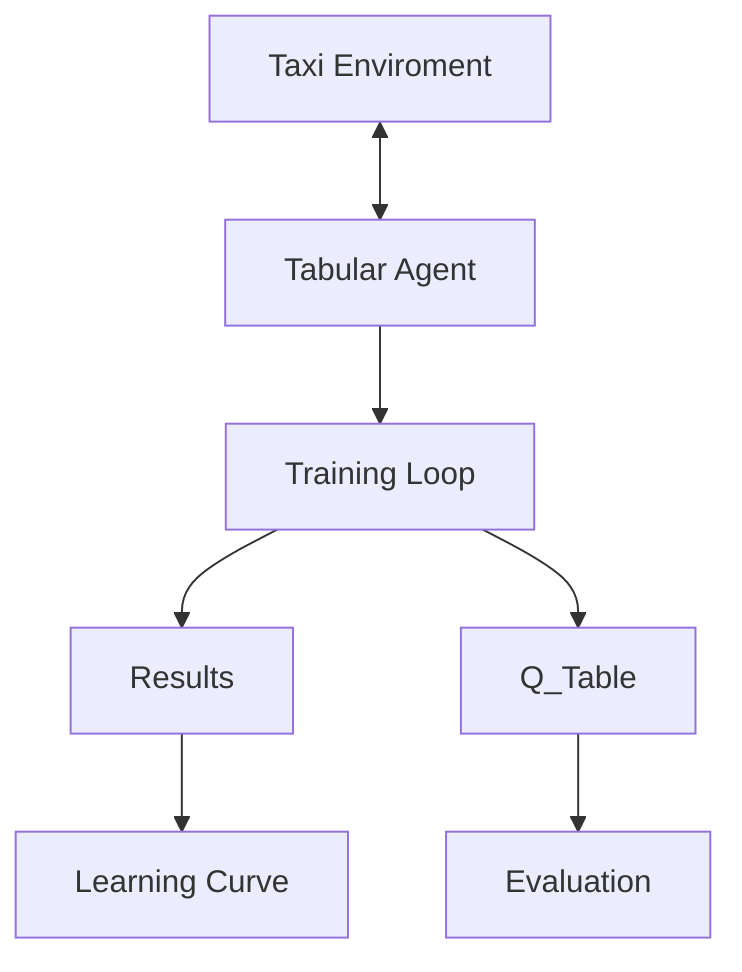

### DQN

The DQN implementation extends the tabular architecture by replacing the explicit Q-table with a neural network–based function approximator and introducing experience replay to stabilize learning. The overall system is organized around the following main components:

- The DQN agent: Handles action selection using an ε-greedy policy, stores transitions in the replay buffer, samples mini-batches, and performs gradient-based updates of the Q-network parameters.

- Replay buffer: Stores past transitions (s,a,r,s‘) and enables randomized mini-batch sampling to break temporal correlations in the training data.

- Neural network module (Q-network): 2 hidden layers, single NN,to approximates $Q_{\theta}(s, a)$

- Training loop: Coordinates the interaction between the DQN agent and the Taxi environment over multiple episodes, triggers experience collection and network updates, and drives the overall learning process.

- Evaluation and logging utilities: Record episode-level statistics for learning-curve analysis and evaluate the trained Q-network after training.

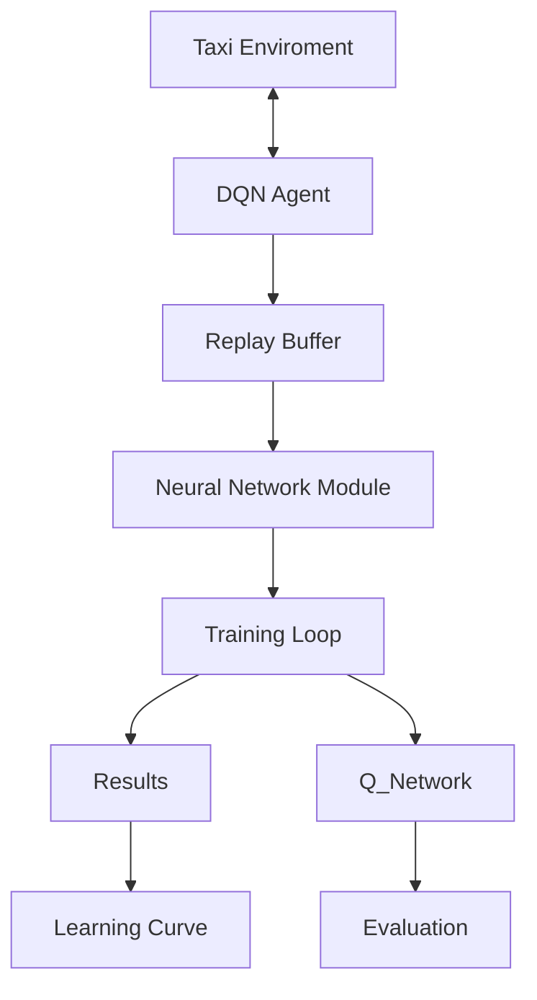
